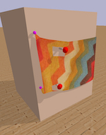

# DEDO: Dynamic Environments with Deformable Objects

**Table of Contents:**<br />
[Tasks](#tasks)<br />
[Installation](#install)<br />
[Basic Examples](#examples)<br />
[RL Examples](#rl)<br />
[Customization](#custom)<br />

## Tasks:

All tasks have `-v0` that randomizes textures and meshes.

All tasks have `-v1` and `-v2` with a particular choice of meshes and textures
that is not randomized. Most tasks have versions up to `-v5` with additional
mesh and texture variations.

Tasks with procedurally generated cloth (`ButtonProc` and `HangProcCloth`)
generate random cloth objects for all versions (but randomize textures only
in `v0`).

### HangBag

`HangBag-v0`: selects one of 108 bag meshes; randomized textures

`HangBag-v[1-3]`: three bag versions with textures shown below:


### HangGarment
`HangGarment-v0`: hang garment with randomized textures 
(a few examples below):


`HangGarment-v[1-5]`: 5 apron meshes and texture combos shown below:


`HangGarment-v[6-10]`: 5 shirt meshes and texture combos shown below:


### HangProcCloth

`HangProcCloth-v0`: random textures, 
procedurally generated cloth with 1 and 2 holes.

`HangProcCloth-v[1-2]`: same, but with either 1 or 2 holes


### Buttoning

`ButtonProc-v0`: randomized textures and procedurally generated cloth with 
2 holes, randomized hole/button positions.

`ButtonProc-v[1-2]`: procedurally generated cloth, 1 or two holes.


`ButtonSimple-v0`: randomized textures, but fixed cloth and button positions.

`ButtonSimple-v1`:  fixed cloth and button positions with one texture 
(see image below):




#### Hoop and Lasso

`Hoop-v0`, `Lasso-v0`: randomized textures

`Hoop-v1`, `Lasso-v1`: pre-selected textures


### Dress

`DressBag-v0`, `DressBag-v[1-5]`: demo for `-v1` shown below


Visualizations of the 5 backpack mesh and texture variants for `DressBag-v[1-5]`:


`DressGarment-v0`, `DressGarment-v[1-5]`: demo for `-v1` shown below


### Mask

`Mask-v0`, `Mask-v[1-5]`: a few texture variants shown below:


<a name="install"></a>
## Installation

Optional initial step: create a new conda environment with
`conda create --name dedo python=3.7` and activate it with
`conda activate dedo`. 
Conda is not strictly needed, alternatives like virtualenv can be used;
a direct install without using virtual environments is ok as well.

Python 3.8 or 3.7 should work, though on some cluster/remote machines we saw
that pybullet installs successfully with python3.7, but has trouble with 3.8.


```
git clone https://github.com/contactrika/dedo
cd dedo
pip install numpy
pip install -e .
```

To enable recording/logging videos install ffmpeg:
```
sudo apt-get install ffmpeg
```

<a name="examples"></a>
### Basic Examples

```
python -m dedo.demo --env=HangBag-v1 --viz --debug
```


```
python -m dedo.demo --env=HangGarment-v1 --cam_resolution 200 --viz --debug
```


<a name="rl"></a>
## RL Examples

`dedo/rl_demo.py` gives an example of how to train an RL
algorithm from Stable Baselines:

```
python -m dedo.rl_demo --env=HangGarment-v0 \
    --logdir=/tmp/dedo --num_play_runs=3 --viz --debug

tensorboard --logdir=/tmp/dedo --bind_all --port 6006 \
  --samples_per_plugin images=1000
```


<a name="custom"></a>
## Customization

To load custom object you would first have to fill an entry in `DEFORM_INFO` in 
`task_info.py`. The key should the the `.obj` file path relative to `data/`:

```
DEFORM_INFO = {
...
    # An example of info for a custom item.
    'bags/custom.obj': {
        'deform_init_pos': [0, 0.47, 0.47],
        'deform_init_ori': [np.pi/2, 0, 0],
        'deform_scale': 0.1,
        'deform_elastic_stiffness': 1.0,
        'deform_bending_stiffness': 1.0,
        'deform_true_loop_vertices': [
            [0, 1, 2, 3]  # placeholder, since we don't know the true loops
        ]
    },
```

Then you can use `--override_deform_obj` flag:

```
python -m dedo.demo --env=HangBag-v0 --cam_resolution 200 --viz --debug \
    --override_deform_obj bags/custom.obj
```


For items not in `DEFORM_DICT` you will need to specify sensible defaults,
for example:

```
python -m dedo.demo --env=HangGarment-v0 --viz --debug \
  --override_deform_obj=generated_cloth/generated_cloth.obj \
  --deform_init_pos 0.02 0.41 0.63 --deform_init_ori 0 0 1.5708
```

Example of scaling up the custom mesh objects:
```
python -m dedo.demo --env=HangGarment-v0 --viz --debug \
   --override_deform_obj=generated_cloth/generated_cloth.obj \
   --deform_init_pos 0.02 0.41 0.55 --deform_init_ori 0 0 1.5708 \
   --deform_scale 2.0 --anchor_init_pos -0.10 0.40 0.70 \
   --other_anchor_init_pos 0.10 0.40 0.70
```
